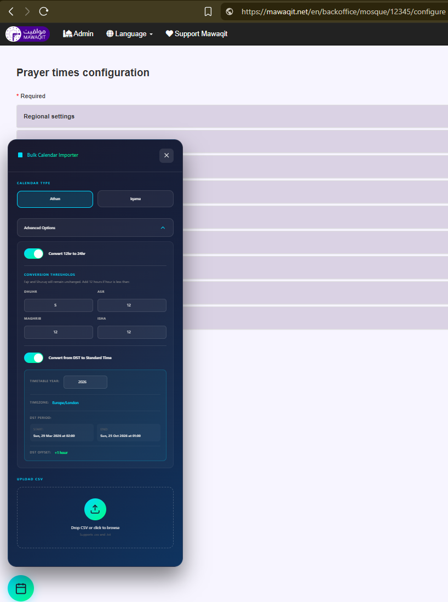

# 📅 Mawaqit Bulk Calendar Importer

A Chrome extension to bulk import prayer times from CSV files into the Mawaqit calendar configuration page.

Screenshot:


## ✨ Features

- 📅 **Bulk Import** - Import Athan or Iqama times for any or all days in the year in a single CSV
- 🌐 **Import from URL** - Fetch CSV directly from a URL (supports Google Sheets and other sources)
- 📁 **Drag & Drop** - Easy CSV upload with drag and drop support
- 🔄 **12hr to 24hr Conversion** - Automatically converts 12-hour format times to 24-hour format
- 🌐 **DST to Standard Time Conversion** - Convert Daylight Saving Time to Standard Time automatically
- 📊 **Real-time Statistics** - View import progress and conversion stats
- 🎨 **Modern Dark UI** - Sleek interface that matches Mawaqit's design
- ✅ **Safe Preview** - Only loads data onto the page for review before submitting

---

## 🚀 Installation

1. Download or clone this repository
2. Open Chrome and go to `chrome://extensions/`
3. Enable **"Developer mode"** (top right)
4. Click **"Load unpacked"**
5. Select the extension folder

---

## 📖 Usage

1. Navigate to your Mawaqit mosque configuration page
2. Click the calendar button in the bottom left corner
3. Select calendar type (**Athan** or **Iqama**)
4. *(Optional)* Configure Advanced Options
5. Either:
   - **Import from URL**: Paste a CSV URL and click **Fetch**, or
   - **Upload a file**: Drag & drop or click to browse for a CSV file

---

## 🌐 Import from URL

Fetch CSV data directly from a URL without downloading the file first.

### Supported Sources

- **Google Sheets** - Use the CSV export URL format:
  ```
  https://docs.google.com/spreadsheets/d/{SHEET_ID}/export?format=csv&gid={GID}
  ```
- **Direct CSV links** - Any publicly accessible CSV file URL
- **Other sources** - Any URL that returns CSV content

### Google Sheets Setup

1. Open your Google Sheet
2. Go to **File > Share > Publish to web**
3. Select the sheet tab and choose **Comma-separated values (.csv)**
4. Click **Publish** and copy the URL
5. Alternatively, use the export URL format above with your sheet ID and gid

### Authentication & Access

- **Public sheets**: Work automatically with direct fetch
- **Restricted sheets**: If authentication is required, the extension will detect this and provide a link to download the CSV manually in a new tab, which you can then upload using the file upload option

### Features

- 📦 **Browser caching** - Uses browser's default cache for repeated fetches
- 📝 **Auto filename detection** - Extracts filename from `Content-Disposition` header when available
- 🔄 **Redirect detection** - Gracefully handles authentication redirects with helpful guidance

---

## ⚙️ Advanced Options

### 🔢 12-Hour to 24-Hour Conversion

Automatically converts times from 12-hour format (e.g., `1:30` for 1:30 PM) to 24-hour format (e.g., `13:30`).

| Prayer   | Default Threshold | Behaviour                          |
|----------|------------------|------------------------------------|
| Fajr     | -                | Always AM (no conversion)          |
| Shuruq   | -                | Always AM (no conversion)          |
| Dhuhr    | 5                | Add 12 hours if hour < 5           |
| Asr      | 12               | Add 12 hours if hour < 12          |
| Maghrib  | 12               | Add 12 hours if hour < 12          |
| Isha     | 12               | Add 12 hours if hour < 12          |

You can customise these thresholds in the Advanced Options panel.

---

### 🌐 DST to Standard Time Conversion

Automatically detects and converts Daylight Saving Time to Standard Time.

#### How it works:

1. **Enable the option** - Toggle "Convert from DST to Standard Time" in Advanced Options
2. **Set the Year** - Enter the timetable year (defaults to current year) to get accurate DST dates
3. **Timezone Detection** - Reads the timezone from your Mawaqit configuration (e.g., `Europe/London`)
4. **DST Period Display** - Shows the exact DST start/end dates with times and offset for your timezone
5. **Automatic Conversion** - For dates and times within the DST period, subtracts the DST offset

#### Example:

For `Europe/London` timezone in 2026:
- **DST Start**: Sun, 29 Mar 2026 at 01:00
- **DST End**: Sun, 25 Oct 2026 at 02:00
- **DST Offset**: +1 hour

If your CSV has `14:30` for a date in July (during DST), it will be converted to `13:30` (Standard Time).

#### Boundary Day Handling:

On DST transition days, the conversion checks both the date AND time:
- **DST Start Day** (e.g., 29 Mar): Only times AFTER the transition hour are converted
- **DST End Day** (e.g., 25 Oct): Only times BEFORE the transition hour are converted

#### Supported DST Offsets:

The extension handles any DST offset, not just 1 hour:
- **60 minutes** - Most common (UK, EU, US)
- **30 minutes** - Lord Howe Island, Australia
- **Other offsets** - Automatically detected

#### Why use this?

Some prayer time calculation sources provide times in DST format during summer months. Mawaqit expects all times in Standard Time, so this feature automatically handles the conversion for you.

---

## 📄 CSV Format

### Athan Calendar

```csv
Month,Day,Fajr,Shuruq,Dhuhr,Asr,Maghrib,Isha
1,1,06:30,08:00,12:30,15:00,17:30,19:00
1,2,06:29,07:59,12:30,15:01,17:31,19:01
```

### Iqama Calendar

```csv
Month,Day,Fajr,Dhuhr,Asr,Maghrib,Isha
1,1,06:45,13:00,15:30,17:35,19:15
1,2,06:44,13:00,15:31,17:36,19:16
```

> **Note:** Iqama calendar does not include Shuruq column.

---

## 📁 Folder Structure

```
mawaqit-bulk-importer/
├── 📄 manifest.json      # Extension configuration
├── 📄 content.js         # Main UI and logic
├── 📄 timeConverter.js   # 12hr to 24hr conversion utility
├── 📄 dstConverter.js    # DST detection and conversion utility
├── 📄 styles.css         # UI styles
├── 📄 README.md          # Documentation
├── 📁 icons/
│   └── 🖼️ icon.svg       # Extension icon
└── 📁 examples/
    └── 📄 *.csv          # Sample CSV files
```

---

## 🛠️ Technical Details

### DST Detection Algorithm

The extension uses the browser's `Intl` API to detect DST transitions:

1. Compares timezone offsets between January and July
2. Identifies if DST is observed (different offsets indicate DST)
3. Scans each day of the year to find exact transition dates
4. Calculates the DST offset (typically 60 minutes)

### Supported Timezones

Any IANA timezone that the browser supports, including:
- `Europe/London`
- `America/New_York`
- `Australia/Sydney`
- And many more...

---

## 📝 License

MIT License - Feel free to use and modify as needed.

---

## 🤝 Contributing

Contributions are welcome! Please feel free to submit a Pull Request.
